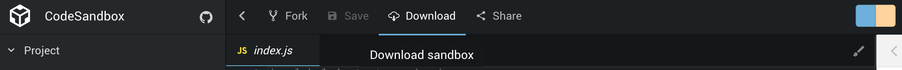

# How to Contribute

## Convention

This repository respect a structure following this particular convention:

* Experimentation name
  * InstantSearch.js
    * src
    * README.md
    * ...
  * React InstantSearch
  * Vue InstantSearch
  * Angular InstantSearch

⚠️ **Warning:** You’re not force to add a version for every flavor of InstantSearch. If it's a new one, just add the flavor(s) you cover.

## Getting Started

To help you get started we provide templates that runs in codesandbox and that you can re-use.

* [InstantSearch.js](https://codesandbox.io/s/github/algolia/instantsearch-templates/tree/master/src/InstantSearch.js)
* [React InstantSearch](https://codesandbox.io/s/github/algolia/instantsearch-templates/tree/master/src/React%20InstantSearch)
* [Angular InstantSearch](https://codesandbox.io/s/github/algolia/instantsearch-templates/tree/master/src/Angular%20InstantSearch) (TODO)
* [Vue InstantSearch](https://codesandbox.io/s/github/algolia/instantsearch-templates/tree/master/src/Vue%20InstantSearch) (TODO)

Once you opened the template on codesandbox, you can easily download it and start hacking!

Source: [InstantSearch Templates](https://github.com/algolia/instantsearch-templates/)

## Readme

Every experimentation should have a README following this structure:

* [CodeSandbox Link](#codesandbox-link)
* [Demo](#demo)
* [Description](#description)
* [Get the code](#get-the-code)
* [Usage](#usage)
* [API](#api)
* [Examples](#examples)
* [Implementation details](#implementation-details)
* [Contributing](#contributing)

You can check this [README](https://github.com/algolia/instantsearch-labs/blob/master/instantsearch-relevance-widget/instantsearch.js/README.md) for a real example.

#### Codesandbox Link

If feasible add a codesandbox link that will allow anyone to play directly with it.

**Link Format**

`https://codesandbox.io/s/github/algolia/instantsearch-labs/tree/master/experimentation-name/instantsearch-flavor`

### Demo

Include a GIF that shows what the experiment is about.

### Description

Explain here what your experimentation is doing and its purposes.

Include a table of contents.

### Get the code

Describe what they need to do, to put the experiment in their own codebase.

### Usage

Add here a snippet of code explaining how to use the experiment.

Add any requirements or known limitation.

### API

Describe the API of the experiment

### Implementation details

Explain how the experiementation was realised, what was used internally.

### Contributing

Explain how to contribution to the experiment.
