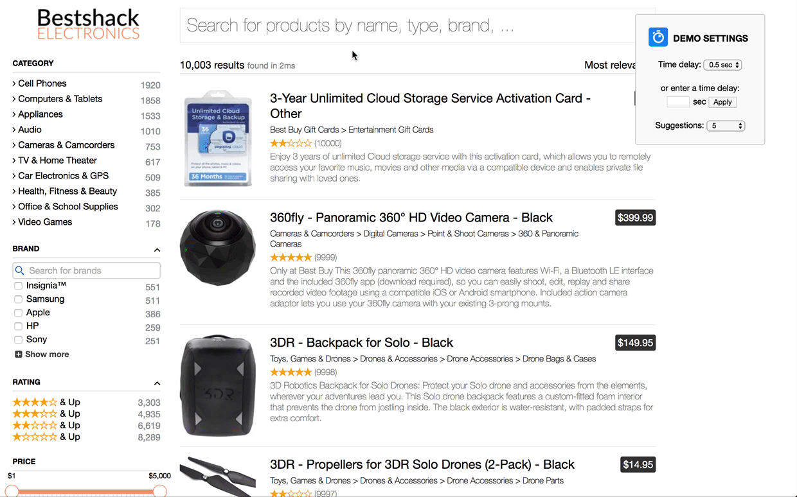

# `autocomplete + delayed IS hits widget`

🎥 **[See it live on CodeSandbox](https://codesandbox.io/s/mzlx3lp3zx).**

🎥 **[See it live on the demo-server](https://internal-preview.algolia.com/delayed-hits-demo).**

## Demo



## Description

### What
An experimental UX which combines autocomplete and instant search, but delays the the instant search results by a few hundred milliseconds of your choosing.  Built on top of [InstantSearch.js](https://community.algolia.com/instantsearch.js/).

### Why
Delaying the instant search results limits visual noise and allows users to better understand what is going on.

### How
A custom instant search widget that integrates autocomplete.js with a query suggestions index as the source.

The widget is built via the [searchBox connector](https://community.algolia.com/instantsearch.js/v2/connectors/connectSearchBox.html).  Connectors are the render-less counterparts of the widgets. They encapsulate all the logic needed for making search widgets. Each one of them is specialized to make a certain type of widget. Read more about our connectors [here](https://community.algolia.com/instantsearch.js/v2/connectors.html).

The custom render function passed to the connector appends an `<input>` with an integrated `autocomplete.js` into the DOM element of your choice. The autocomplete is populated with suggestions from a suggestion index, and when one of these suggestions is chosen, makes this the query. The number of suggestions is an optional parameter with a default of 5.

Additionally, whenever a keystroke is entered, a timer is used to determine when to update the instant search hits in the background.  The time delay is an optional parameter with a default of 500 ms. 

### Requirements
Both the autocomplete plug-in as well as the custom widget make use of jQuery.  As such, the `autocomplete-widget.js` must be included after `autocomplete.js` which should be included after jQuery.

## Installation

The `autocomplete.js` library must be included **after** jQuery, Zepto or Angular.js (with jQuery).

### jsDelivr

```html
<script src="https://cdn.jsdelivr.net/autocomplete.js/0/autocomplete.min.js"></script>
<!-- OR -->
<script src="https://cdn.jsdelivr.net/autocomplete.js/0/autocomplete.jquery.min.js"></script>
<!-- OR -->
<script src="https://cdn.jsdelivr.net/autocomplete.js/0/autocomplete.angular.min.js"></script>
```

### cdnjs

```html
<script src="https://cdnjs.cloudflare.com/ajax/libs/autocomplete.js/<VERSION>/autocomplete.min.js"></script>
<!-- OR -->
<script src="https://cdnjs.cloudflare.com/ajax/libs/autocomplete.js/<VERSION>/autocomplete.jquery.min.js"></script>
<!-- OR -->
<script src="https://cdnjs.cloudflare.com/ajax/libs/autocomplete.js/<VERSION>/autocomplete.angular.min.js"></script>
```

## Running the experimentation locally

```
yarn
yarn start
```

## Tutorial

### Step 0 
* Include jQuery and autocomplete.js (See above.)

### Step 1
* Copy the custom render function from [autocomplete-widget.js](/src/autocomplete-widget.js)
* Set delay time in ms / nb suggestions as you see fit

### Step2
* Add the custom widget to the instant search instance

### Step 3
* Profit! 💵💵💵

## Additional Reading
[Check out the blogpost about autocomplete on mobile](https://blog.algolia.com/search-autocomplete-on-mobile/)

