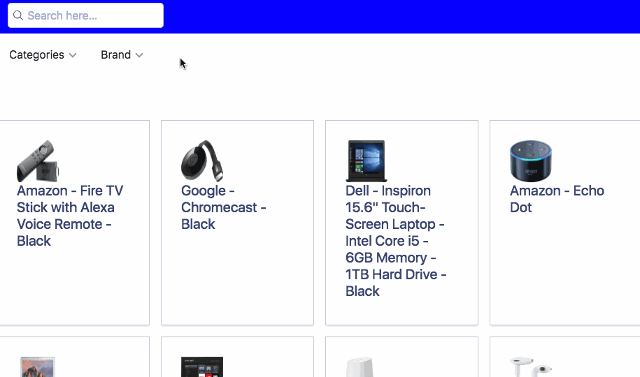

#DropdownRefinementList Widget

🎥 **[See it live on CodeSandbox](https://codesandbox.io/s/6x3l73pkpw).**

## Demo



## Description

This is a Dropdown RefinementList for [Algolia's](https://www.algolia.com) React InstantSearch Library. It's meant to display facets horizontally for better responsive use-cases on mobile and allows more flexible UX patterns for your UI.

It handles:

* Horizontal display of each desirable facet value
* click/hover list that shows each facet value's title and number of results
* Display the number of active facet values per facet attribute
* Mobile responsive
* Horizontal scroll for mobile

<!-- START doctoc generated TOC please keep comment here to allow auto update -->

<!-- DON'T EDIT THIS SECTION, INSTEAD RE-RUN doctoc TO UPDATE -->

**Table of Contents**

* [Demo](#demo)
* [Description](#description)
* [Get the code](#get-the-code)
  * [JavaScript](#javascript)
  * [CSS](#css)
* [Usage](#usage)
  * [Requirements](#requirements)
* [Examples](#examples)
* [API](#api)
  * [Props](#props)
* [Implementation details](#implementation-details)
* [Contributing](#contributing)

<!-- END doctoc generated TOC please keep comment here to allow auto update -->

## Get the code

This widget comes with JavaScript but also pre-defined CSS.

### JavaScript

You can copy and paste the JavaScript code from the repository itself, grab it in [src/component/DropdownRefinementList.js](src/component/DropdownRefinementList.js).

### CSS

You can copy and paste the necessary CSS code from the repository itself, grab it in [src/DropdownRefinementList.css](src/component/DropdownRefinementList.css).

## Usage

The simplest usage is:

```js
<DropdownRefinementList attribute={'brand'} />
```

### Requirements

The attribute passed to the attribute prop must be present in “attributes for faceting” on the Algolia dashboard or configured as attributesForFaceting via a set settings call to the Algolia API.

If you are using the searchable prop, you’ll also need to make the attribute searchable using the [dashboard](https://www.algolia.com/explorer/display/) or using the [API](https://www.algolia.com/doc/guides/searching/faceting/#search-for-facet-values).

## Examples

* using the `connectRefinementList()` connector: [CodeSandbox](https://codesandbox.io/s/6x3l73pkpw)

## API

### Props

| Name                                                                                                                                                                                                                                                                           | Type       |                  |
| ------------------------------------------------------------------------------------------------------------------------------------------------------------------------------------------------------------------------------------------------------------------------------ | ---------- | ---------------- |
| **attribute\***                                                                                                                                                                                                                                                                | `string`   |
| the name of the attribute in record                                                                                                                                                                                                                                            |
| **hoverable**                                                                                                                                                                                                                                                                  | `boolean`  | default: `false` |
| when `false`, dropdown refinement list requires a click to expand                                                                                                                                                                                                              |
| **limit**                                                                                                                                                                                                                                                                      | `number`   | default: `20`    |
| the max number of displayed items                                                                                                                                                                                                                                              |
| **operator**                                                                                                                                                                                                                                                                   | `string`   | default: `or`    |
| How to apply the refinements. Possible values: ‘or’ or ‘and’.                                                                                                                                                                                                                  |
| **defaultRefinement**                                                                                                                                                                                                                                                          | `string[]` |
| the values of the items selected by default. The searchState of this widget takes the form of a list of strings, which correspond to the values of all selected refinements. However, when there are no refinements selected, the value of the searchState is an empty string. |
| **transformItems**                                                                                                                                                                                                                                                             | `function` |
| Function to modify the items being displayed, e.g. for filtering or sorting them. Takes an items as parameter and expects it back in return.                                                                                                                                   |

## Implementation details

This widget is implemented using the [`connectRefinementList`](https://community.algolia.com/react-instantsearch/connectors/connectRefinementList.html) connector.
To learn more about connectors, you can read the associated [guide](https://community.algolia.com/react-instantsearch/guide/Connectors.html).

## Contributing

To contribute to the project, clone this repository then run:

```sh
yarn
yarn start
```
