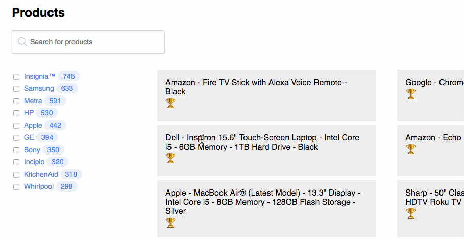

# `relevancyWidget()`



## Description

This is the `relevancyWidget()` labs widget for [InstantSearch.js](https://community.algolia.com/instantsearch.js/). You can use this widget to gain an understanding on why a hit is being ranked the way it is.

This widget displays the same kind of 🏆 ranking information the [Algolia dashboard presents](https://www.algolia.com/doc/tutorials/full-text-search/relevance/how-to-troubleshoot-relevance) but directly into your search UI to help you debug the ranking of results.

This widget aims to create a third way to reason about result rankings: with a custom widget inserted directly on the search UI. This could be useful on a staging site, to quickly understand the ranking info without changing context.

[See it live on CodeSandbox](https://codesandbox.io/s/vq8kmjn8m5).

<!-- START doctoc generated TOC please keep comment here to allow auto update -->
<!-- DON'T EDIT THIS SECTION, INSTEAD RE-RUN doctoc TO UPDATE -->
**Table of Contents**

- [Get the code](#get-the-code)
  - [JavaScript](#javascript)
  - [CSS](#css)
- [Usage](#usage)
  - [Requirements](#requirements)
- [API](#api)
  - [relevancyWidget(opts)](#relevancywidgetopts)
- [Examples](#examples)
- [Implementation details](#implementation-details)
- [Contributing](#contributing)

<!-- END doctoc generated TOC please keep comment here to allow auto update -->

## Get the code

This widget comes with JavaScript but also pre-defined CSS.

### JavaScript

You can copy paste the JavaScript code from the repository itself, grab it in [src/relevancyWidget.js](src/relevancyWidget.js).

### CSS

You can copy paste the necessary CSS code from the repository itself, grab it in [src/relevancyWidget.css](src/relevancyWidget.css).

## Usage

The simplest usage is:

```js
const search = instantsearch({
  appId: '...',
  apiKey: '...',
  indexName: '...'
});

search.addWiget(instantsearch.widgets.hits({container: '#hits'}));
search.addWiget(relevancyWidget());
```

### Requirements

The default usage requires that you use the default `hits()` widget. If you want to use the relevancy widget when not using the `hits()` widget but maybe `connectHits()` or any other way of disaplying hits then read the [API documentation](#api) or the [advanced example](#without-using-the-hits-widget).

## API

### relevancyWidget(opts)

Returns a relevancy widget to be added to an InstantSearch.js instance.

## Examples

- using the `hits()` widget: [TODO CodeSandbox](TODO)
- using the `connectHits()` connector: [TODO CodeSandbox](TODO)

## Implementation details

This widget is implemented using a [custom widget](https://community.algolia.com/instantsearch.js/v2/guides/custom-widget.html), it uses the `getConfiguration` part of the widget lifecycle to configure the [`getRankingInfo` search parameter](https://www.algolia.com/doc/api-reference/api-parameters/getRankingInfo/) from the Algolia API. Setting this parameter to `true` is necessary to get the actual ranking information of hits.

## Contributing

To contribute to the project, clone this repository then run:

```sh
yarn
yarn start
```
