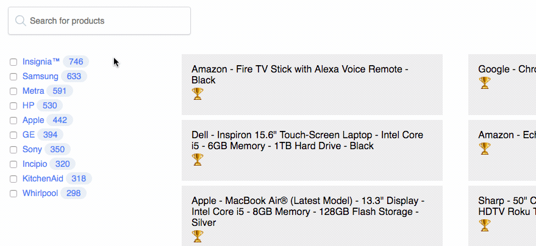

# `relevancyWidget()`



## Description

This is the `relevancyWidget()` labs widget for [InstantSearch.js](https://community.algolia.com/instantsearch.js/). You can use this widget to gain an understanding on why a hit is being ranked the way it is.

This widget displays the same kind of 🏆 ranking information the [Algolia dashboard presents](https://www.algolia.com/doc/tutorials/full-text-search/relevance/how-to-troubleshoot-relevance) but directly into your search UI to help you debug the ranking of results.

This widget aims to create a third way to reason about result rankings: with a custom widget inserted directly on the search UI. This could be useful on a staging site, to quickly understand the ranking info without changing context.

[See it live on CodeSandbox](https://codesandbox.io/s/vq8kmjn8m5) TODO => this codesandbox should be the first example.

TODO: table of contents

## Get the code

### JavaScript

### CSS

## API

## Requirements

## Examples

### Using the `hits()` widget

### Without using the `hits()` widget

### Implementation details

### Contributing

## Running the experimentation locally

### OLD README

```sh
yarn
yarn start
```

## Tutorial

For deeper dive into creating custom widgets for InstantSearch, you can check out the [guide](https://community.algolia.com/instantsearch.js/v2/guides/custom-widget.html). I’ll be going over the steps I used to create this relevancy widget.

### Create Custom Widget

First step is to create the custom widget. This can be done by extending the instantsearch.widgets namespace, like regular widgets.

```js
instantsearch.widgets.customRankingInfo = function customRankingInfo({

  // code for widget will go here

});
```

### Step2

Next let's take a look at which stages of the [widget lifecycle](https://community.algolia.com/instantsearch.js/v2/guides/custom-widget.html#the-widget-lifecycle-and-api) will apply in this case.

* `getConfiguration`

To ensure that each hit is returned with the `_rankingInfo` attribute, we'll add it as a search parameter in the `getConfiguration` method.

```js
getConfiguration() {
  return {
    getRankingInfo: true
  };
}
```

* `render`

This part will be run each time results are returned from Algolia.

```js
render({ results }) {
  // select all the result hits on the page
  const searchHits = container.querySelectorAll('.ais-hits--item');
  // check to see if ranking info container already exists in the hit & remove it to avoid duplicates
  searchHits.forEach((hit, i) => {
    if (hit.querySelector('.hit-ranking-info')) {
      hit.querySelector('.hit-ranking-info').remove();
    }
    // add an id to each result hit so we can target them later
    hit.id = `hit-${i}`;
  });

  // iterrate over each hit to create html that will contain ranking info
  results.hits.forEach((hit, i) => {
    const resultsContainer = document.createElement('div');
    resultsContainer.className = 'hit-ranking-info';
    const trophy = document.createElement('span');
    trophy.innerText = '🏆';
    resultsContainer.appendChild(trophy);
    let resultsUl = document.createElement('ul');
    const rankingHtml = Object.entries(hit._rankingInfo).map(
      ([key, val]) => {
        return `<li><span>${key}: </span> <span>${val}</span></li>`;
      }
    );
    resultsUl.innerHTML = rankingHtml.join('');
    resultsContainer.appendChild(resultsUl);
    // append ranking results to hit
    container.querySelector(`#hit-${i}`).appendChild(resultsContainer);
  });
}
```

### Add the Widget to the DOM

The final JavaScript step is actually adding the widget to the DOM. Since our widget needs to target the hits, we'll be sure to add it directly _after_ the `hits` widget.

```js
search.addWidget(
  instantsearch.widgets.customRankingInfo({
    container: '#products'
  })
);
```

### Add Some Light Styling

To keep simplify things, we can show and hide the widget using CSS. By default the ranking info will be set to `opacity: 0`, and when the trophy icon is hovered, we'll display it by setting the opacity to 1.

Here is the relevant CSS to the widget.

```css
.hit-ranking-info ul {
  height: 0;
  opacity: 0;
  position: absolute;
  list-style: none;
  color: #fff;
  background: #383838;
  padding: 8px;
  border-radius: 3px;
  margin: 0;
  letter-spacing: 0.05em;
  z-index: 2;
}

.hit-ranking-info span {
  cursor: pointer;
  font-size: 16px;
}

.hit-ranking-info span:hover + ul {
  height: auto;
  opacity: 1;
}
```

It's also important to remember that the hit element itself should be `position: relative`.
